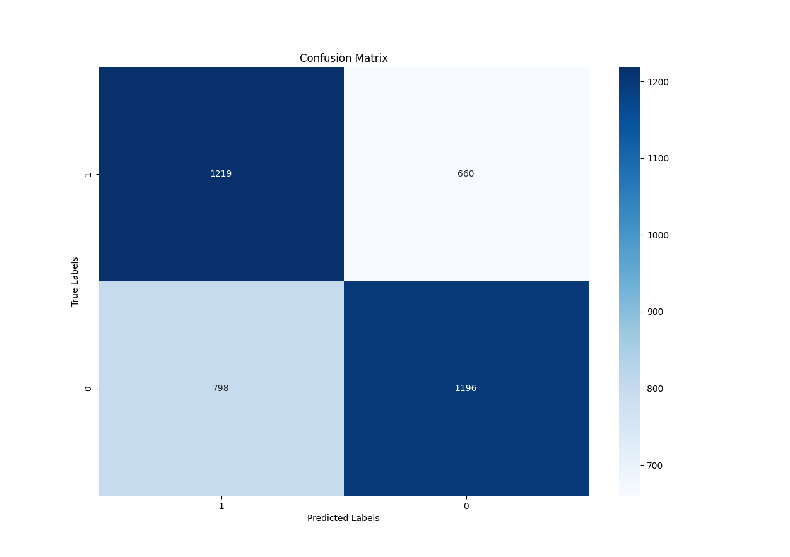
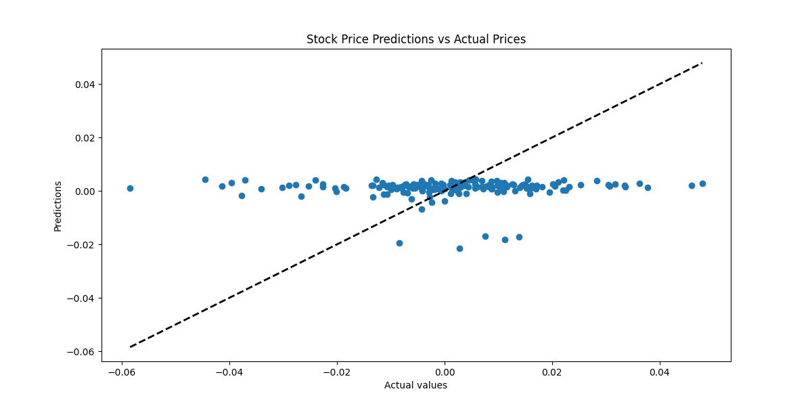
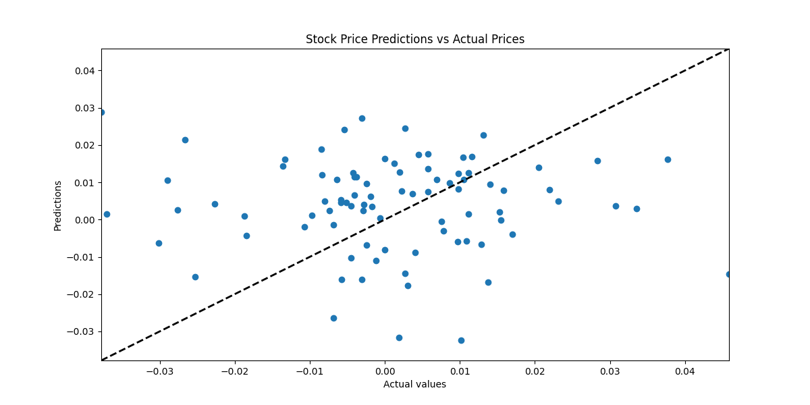

# Stock price predictions

## Overview

> The primary objective of this project is to develop a machine learning model that can predict future stock prices based on historical market data.

> This project involves collecting historical stock market data, preprocessing the data, engineering features, building and training a machine learning model, and evaluating model performance using the MLPClassifier tool.

## Tools

> **Programming Language:** Python

> **Libraries:** Pandas, NumPy, Scikit-learn, Matplotlib/Seaborn, PyTorch

> **Version Control:** Git/GitHub 

> **Datasets:** [Stock price datasets](https://www.kaggle.com/datasets/borismarjanovic/price-volume-data-for-all-us-stocks-etfs) and [News dataset](https://www.kaggle.com/datasets/aaron7sun/stocknews)

## Project Phases

**1. Data Collection**
> **Source:** Collect historical stock data and daily news from Kaggle

> **Data Structure:** The stock data will include Open, Close Volume, and a percentage change between the opening prices of two consecutive days. The news data will include the top 5 news of a day.

**2. Data Preprocessing**
> **Getting the perfect dataset:** Take the news data csv and use PyTorch for word embedding. Merge however many company stock data you want to get a bigger dataset, and add the embedded news to it. Finally, split the dataset into training and testing

> **Normalization:** Normalize the features to ensure they are on a similar scale.

> **Feature Engineering:** Compute percentage changes in stock prices to capture the relative movement between periods. Create two bins in which we will place the predicted price, one for negative relative values named 1, and the other for positive ones named 0.

**3. Model Selection and Training**
> **Model Choice:** Explore various models, such as Linear Regression, Gradient Boosting, and Classification.

> **Optimization:** Tune hyperparameters using GridSearchCV to enhance model accuracy

**4. Model Evaluation**
> **Metrics:** Use evaluation metrics such as R-squared to assess the model.

> **Backtesting:** Simulate the model's performance using the data to see how it would have predicted in the past and compute the predicted profit for each day. Do this by investing 100$ every day.

> **Visualization:** Plot the confusion matrix and the profits to visualize the model's performance.

## Challenges and Considerations

> **Market Volatility:** Stock prices are highly volatile and influenced by numerous unpredictable factors such as economic news, political events, and market sentiment.

> **Overfitting:** Avoid overfitting by ensuring that the model generalizes well to unseen data.

> **Data Quality:** Ensure that the data used is accurate and representative of the market conditions.

## Outcomes

**1. Scores**

> **Train Score:** 0.7561534058385804

> **Test Score:** 0.6336173508907823

**2. Confusion Matrix**

> [[1195  680]

> [ 739 1259]]

**3. Classification Report**

> |                  | precision | recall | f1-score | support |
> | :----------:     | :-------: | :----: | :------: | :-----: |
> | **Bin "0"**      | 0.62      | 0.64   | 0.63     | 1875    |
> | **Bin "1"**      | 0.65      | 0.63   | 0.64     | 1998    |
> | **accuracy**     |           |        | 0.63     | 3873    |
> | **macro avg**    | 0.63      | 0.63   | 0.63     | 3873    |
> | **weighted avg** | 0.63      | 0.63   | 0.63     | 3873    |

**4. Investing 100$ every day**

> **Profits when the model says to go long:** 1332.3387414206418

> **Profits when the model says to short:** -1587.969129023618

> **Missing profits due to false negatives:** 977.5552751934508

**6. Plots**

    

> **Figure 1:** Confusion matrix of the classification

    

> **Figure 2:** Investing 100$ every day profits visualization

## Progression

> We experimented with several machine learning models, including linear regression and gradient boosting, but they didn't yield optimal results. Despite their potential, these models fell short in accurately capturing the patterns needed for effective predictions.

    

> **Figure 1:** Gradient boosting using relative values (percentage change)

    

> **Figure 2:** Neural network linear regression 
